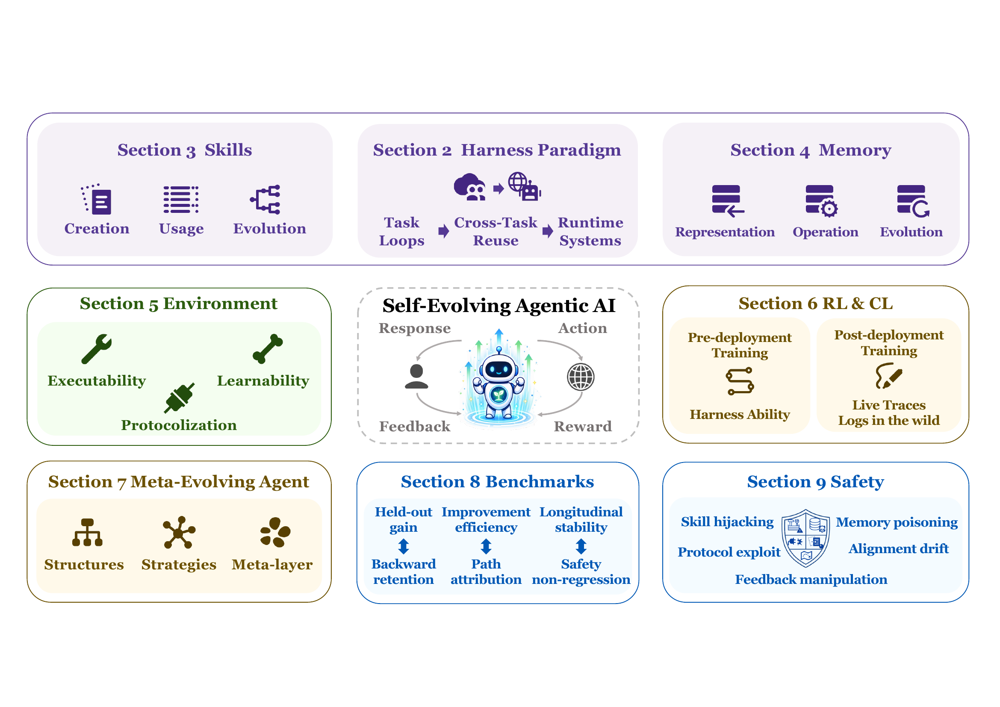
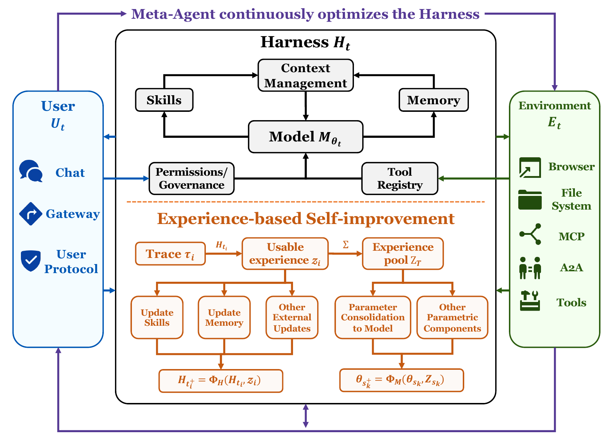

<div align="center">



## Self-Improving Agents in the Era of Experience: A Survey of Self- to Meta-Evolution

[](https://github.com/sindresorhus/awesome)
[](#citation)
[](https://openreview.net/pdf?id=IUltZSgLMm)
[](https://frontis.ai)
[](https://frontisai.github.io/Awesome-Self-Improving-Agents/)

</div>

> We welcome issues and pull requests for missing work on harness agents, agent skills, memory, self-improvement, agent RL, evaluation, and safety.

## News

- **[2026-06-25] 🎉 Release:** Our survey is now available on [OpenReview](https://openreview.net/pdf?id=IUltZSgLMm).

## Citation

If you find this survey or paper list helpful, please cite our work:

```bibtex
@article{jiang2026selfimprovingagents,
  title={Self-Improving Agents in the Era of Experience: A Survey of Self- to Meta-Evolution},
  author={Che Jiang and Jincheng Zhong and Yu Fu and Kai Tian and Junlin Yang and Kaikai Zhao and Yuchong Wang and Tianwei Luo and Weizhi Wang and Yuxin Zuo and Guoli Jia and Xingtai Lv and Dianqiao Lei and Sihang Zeng and Yuru Wang and Zhenzhao Yuan and Xinwei Long and Ermo Hua and Can Ren and Xin Jiang and Shulei Xie and Yuanchun Zheng and Youbang Sun and Biqing Qi and Ning Ding and Kaiyan Zhang and Bowen Zhou},
  journal={OpenReview Archive},
  year={2026},
  url={https://openreview.net/pdf?id=IUltZSgLMm}
}
```

## Contents

- [Overview](#overview)
- [Paper List](#paper-list)
  - [Foundations and Surveys](#foundations-and-surveys)
  - [Harness and Runtime Architecture](#harness-and-runtime-architecture)
  - [Skills and Skill Libraries](#skills-and-skill-libraries)
  - [Memory and Context Management](#memory-and-context-management)
  - [Environments, Tools, and Runtime Feedback](#environments-tools-and-runtime-feedback)
  - [Agent RL and Continual Learning](#agent-rl-and-continual-learning)
  - [Meta-Agents and Evolution Orchestration](#meta-agents-and-evolution-orchestration)
  - [Evaluation and Benchmarks](#evaluation-and-benchmarks)
  - [Safety and Governance](#safety-and-governance)
- [Acknowledgment](#acknowledgment)
- [Star History](#star-history)

## Overview

This repository collects papers, systems, benchmarks, and resources for studying how deployed agentic AI systems become more capable after deployment.

We organize the landscape around the **harness agent**: a deployed runtime system whose behavior is jointly shaped by a base model, a mutable harness, a user-facing interface, and an environment-facing interface. Under this view, self-improvement first appears as fast runtime adaptation over external surfaces such as skills, memory, context, tools, and execution environments. Repeated experience may later be consolidated into model parameters through reinforcement learning, fine-tuning, or continual learning.

<p align="center">
   
</p>


We organize the survey into four parts:

1. **Paradigm shift:** from task-bounded tool-use loops to deployed harness-centered runtime systems.
2. **External path:** skills, memory, context, tools, and environments as editable runtime adaptation surfaces.
3. **Parameter path and meta-evolution:** agent RL, continual learning, and meta-agents for durable learning and update orchestration.
4. **Conditions and limits:** evaluation, safety, governance, and open problems for reliable post-deployment improvement.

## Paper List

This paper list follows the references cited by the LaTeX manuscript. It currently includes **331 unique cited entries** from 379 unique manuscript citation keys and 379 cited BibTeX records.

Every row includes a date, display name, title, and at least one public source badge. Cited entries whose public source URL still needs verification are omitted from this table until complete metadata is available (44 currently omitted; 4 duplicate cited records collapsed).

### Foundations and Surveys

| Date | Name | Title | Paper | Github |
|:-:|:-:|:-|:-:|:-:|
| 2026-06 | `OpenSkill` | OpenSkill: Open-World Self-Evolution for LLM Agents | [](https://arxiv.org/abs/2606.06741) | - |
| 2026-05 | `huang2026rawexperience` | From Raw Experience to Skill Consumption: A Systematic Study of Model-Generated Agent Skills | [](https://arxiv.org/abs/2605.23899) | - |
| 2026-05 | `SkillOpt` | SkillOpt: Executive Strategy for Self-Evolving Agent Skills | [](https://arxiv.org/abs/2605.23904) | - |
| 2026-04 | `cursor2026cursor3` | Meet the New Cursor | [](https://cursor.com/blog/cursor-3) | - |
| 2026-04 | `neuralcomputers2026_paper` | Neural Computers | [](https://arxiv.org/abs/2604.06425) | - |
| 2026-04 | `SWE-chat` | SWE-chat: Coding Agent Interactions From Real Users in the Wild | [](https://arxiv.org/abs/2604.20779) | - |
| 2026-01 | `AI Agent Systems` | AI Agent Systems: Architectures, Applications, and Evaluation | [](https://arxiv.org/abs/2601.01743) | - |
| 2025-08 | `fang2025selfevolvingagents` | A Comprehensive Survey of Self-Evolving AI Agents: A New Paradigm Bridging Foundation Models and Lifelong Agentic Systems | [](https://arxiv.org/abs/2508.07407) | - |
| 2025-07 | `A Survey of Self-Evolving Agents` | A Survey of Self-Evolving Agents: What, When, How, and Where to Evolve on the Path to Artificial Super Intelligence | [](https://arxiv.org/abs/2507.21046) | - |
| 2025-06 | `chen2025compoundaisystems` | From Standalone LLMs to Integrated Intelligence: A Survey of Compound AI Systems | [](https://arxiv.org/abs/2506.04565) | - |
| 2025-02 | `anthropic2025claudecode` | Claude 3.7 Sonnet and Claude Code | [](https://www.anthropic.com/news/claude-3-7-sonnet) | - |
| 2025-01 | `silver2025eraexperience` | Welcome to the Era of Experience | [](https://storage.googleapis.com/deepmind-media/Era-of-Experience%20/The%20Era%20of%20Experience%20Paper.pdf) | - |
| 2024-05 | `WildChat` | WildChat: 1M ChatGPT Interaction Logs in the Wild | [](https://arxiv.org/abs/2405.01470) | - |
| 2024-04 | `tao2024selfevolutionsurvey` | A Survey on Self-Evolution of Large Language Models | [](https://arxiv.org/abs/2404.14387) | - |
| 2024-01 | `langchain2024langgraph` | LangGraph | [](https://www.langchain.com/blog/langgraph) | - |
| 2023-09 | `xi2023riseagentsurvey` | The Rise and Potential of Large Language Model Based Agents: A Survey | [](https://arxiv.org/abs/2309.07864) | - |
| 2023-08 | `wang2023llmagentsurvey` | A Survey on Large Language Model based Autonomous Agents | [](https://arxiv.org/abs/2308.11432) | - |
| 2022-01 | `ahn2022can` | Do as i can, not as i say: Grounding language in robotic affordances | [](https://arxiv.org/abs/2204.01691) | - |

### Harness and Runtime Architecture

| Date | Name | Title | Paper | Github |
|:-:|:-:|:-|:-:|:-:|
| 2026-06 | `recursive2026automatedresearch` | First Steps Toward Automated AI Research | [](https://www.recursive.com/articles/first-steps-toward-automated-ai-research) | - |
| 2026-06 | `osmani2026loopengineering` | Loop Engineering | [](https://addyo.substack.com/p/loop-engineering) | - |
| 2026-06 | `Traj-Evolve` | Traj-Evolve: A Self-Evolving Multi-Agent System for Patient Trajectory Modeling in Lung Cancer Early Detection | [](https://arxiv.org/abs/2606.02812) | - |
| 2026-05 | `Agent Harness Engineering` | Agent Harness Engineering: A Survey | [](https://openreview.net/forum?id=eONq7FdiHa) | - |
| 2026-04 | `meng2026agentharness` | Agent Harness for Large Language Model Agents: A Survey | [](https://www.preprints.org/manuscript/202604.0428/v2) | - |
| 2026-04 | `boeckeler2026harnessengineering` | Harness Engineering for Coding Agent Users | [](https://martinfowler.com/articles/harness-engineering.html) | - |
| 2026-04 | `martin2026harnessfailures` | Most AI Agent Failures Are Harness Failures | [](https://www.martintechlabs.com/blog/most-ai-agent-failures-are-harness-failures) | - |
| 2026-04 | `Scaling Managed Agents` | Scaling Managed Agents: Decoupling the Brain from the Hands | [](https://www.anthropic.com/engineering/managed-agents) | - |
| 2026-04 | `xu2026futureagentsopensource` | The Future of Agents is Open Source (part 1 of 2) | [](https://www.basisset.com/insights/the-future-of-agents-is-open-source-part-1-of-2) | - |
| 2026-03 | `cursor2026composer2` | Composer 2 Technical Report | [](https://arxiv.org/abs/2603.24477) | - |
| 2026-03 | `yue2026workflowsurvey` | From Static Templates to Dynamic Runtime Graphs: A Survey of Workflow Optimization for LLM Agents | [](https://arxiv.org/abs/2603.22386) | - |
| 2026-02 | `Unlocking the Codex harness` | Unlocking the Codex harness: how we built the App Server | [](https://openai.com/index/unlocking-the-codex-harness/) | - |
| 2026-01 | `openharness2026_repo` | OpenHarness | [](https://github.com/HKUDS/OpenHarness) | [](https://github.com/HKUDS/OpenHarness) |
| 2025-11 | `young2025effectiveharnesses` | Effective Harnesses for Long-Running Agents | [](https://www.anthropic.com/engineering/effective-harnesses-for-long-running-agents) | - |
| 2025-07 | `mei2025contextengineering` | A Survey of Context Engineering for Large Language Models | [](https://arxiv.org/abs/2507.13334) | - |
| 2025-05 | `Darwin Godel Machine` | Darwin Godel Machine: Open-Ended Evolution of Self-Improving Agents | [](https://arxiv.org/abs/2505.22954) | - |
| 2025-05 | `openai2025codex` | Introducing Codex | [](https://openai.com/index/introducing-codex/) | - |
| 2020-01 | `Artificial Intelligence` | Artificial Intelligence: A Modern Approach | [](https://aima.cs.berkeley.edu/) | - |
| 2003-01 | `Goedel Machines` | Goedel Machines: Self-Referential Universal Problem Solvers Making Provably Optimal Self-Improvements | [](https://arxiv.org/abs/cs/0309048) | - |

### Skills and Skill Libraries

| Date | Name | Title | Paper | Github |
|:-:|:-:|:-|:-:|:-:|
| 2026-06 | `li2026agenticenvironmentengineering` | Agentic Environment Engineering for Large Language Models: A Survey of Environment Modeling, Synthesis, Evaluation, and Application | [](https://arxiv.org/abs/2606.12191) | - |
| 2026-05 | `zhou2026cta` | Counterfactual Trace Auditing of LLM Agent Skills | [](https://arxiv.org/abs/2605.11946) | - |
| 2026-05 | `Group of Skills` | Group of Skills: Group-Structured Skill Retrieval for Agent Skill Libraries | [](https://arxiv.org/abs/2605.06978) | - |
| 2026-05 | `MIND-Skill` | MIND-Skill: Quality-Guaranteed Skill Generation via Multi-Agent Induction and Deduction | [](https://arxiv.org/abs/2605.08670) | - |
| 2026-05 | `MUSE-Autoskill` | MUSE-Autoskill: Self-Evolving Agents via Skill Creation, Memory, Management, and Evaluation | [](https://arxiv.org/abs/2605.27366) | - |
| 2026-05 | `OpenClaw Research` | OpenClaw Research: A Systematic Survey of Large Language Model Agents in Open Deployment | [](https://ykc1.github.io/OpenClaw_Survey_Web/) | - |
| 2026-05 | `SkillEvolver` | SkillEvolver: Skill Learning as a Meta-Skill | [](https://arxiv.org/abs/2605.10500) | - |
| 2026-05 | `SkillRAE` | SkillRAE: Agent Skill-Based Context Compilation for Retrieval-Augmented Execution | [](https://arxiv.org/abs/2605.10114) | - |
| 2026-05 | `SkillRet` | SkillRet: A Large-Scale Benchmark for Skill Retrieval in LLM Agents | [](https://arxiv.org/abs/2605.05726) | - |
| 2026-04 | `CoEvoSkills` | CoEvoSkills: Self-Evolving Agent Skills via Co-Evolutionary Verification | [](https://arxiv.org/abs/2604.01687) | - |
| 2026-04 | `Corpus2Skill` | Corpus2Skill: Distilling Document Corpora into Hierarchical Skill Directories for Agent Navigation | [](https://arxiv.org/abs/2604.14572) | - |
| 2026-04 | `Externalization in LLM Agents` | Externalization in LLM Agents: A Unified Review of Memory, Skills, Protocols and Harness Engineering | [](https://arxiv.org/abs/2604.08224) | - |
| 2026-04 | `hivemind2026_repo` | Hivemind: Continual Learning Layer that Distills Coding-Agent Session Trajectories into Reusable Skills | [](https://github.com/activeloopai/hivemind) | [](https://github.com/activeloopai/hivemind) |
| 2026-04 | `skillswild2026realistic` | How Well Do Agentic Skills Work in the Wild: Benchmarking LLM Skill Usage in Realistic Settings | [](https://arxiv.org/abs/2604.04323) | - |
| 2026-04 | `SKILL0` | SKILL0: In-Context Agentic Reinforcement Learning for Skill Internalization | [](https://arxiv.org/abs/2604.02268) | - |
| 2026-04 | `SkillX` | SkillX: Automatically Constructing Skill Knowledge Bases for Agents | [](https://arxiv.org/abs/2604.04804) | - |
| 2026-03 | `bi2026repositorymining` | Automating Skill Acquisition through Large-Scale Mining of Open-Source Agentic Repositories: A Framework for Multi-Agent Procedural Knowledge Extraction | [](https://arxiv.org/abs/2603.11808) | - |
| 2026-03 | `AutoSkill` | AutoSkill: Experience-Driven Lifelong Learning via Skill Self-Evolution | [](https://arxiv.org/abs/2603.01145) | - |
| 2026-03 | `d2skill2026dynamic` | Dynamic Dual-Granularity Skill Bank for Agentic RL | [](https://arxiv.org/abs/2603.28716) | - |
| 2026-03 | `EvoSkill` | EvoSkill: Automated Skill Discovery for Multi-Agent Systems | [](https://arxiv.org/abs/2603.02766) | - |
| 2026-03 | `From Model to Agent` | From Model to Agent: Equipping the Responses API with a Computer Environment | [](https://openai.com/index/equip-responses-api-computer-environment) | - |
| 2026-03 | `MetaClaw` | MetaClaw: Just Talk -- An Agent That Meta-Learns and Evolves in the Wild | [](https://arxiv.org/abs/2603.17187) | - |
| 2026-03 | `SkillNet` | SkillNet: Create, Evaluate, and Connect AI Skills | [](https://arxiv.org/abs/2603.04448) | - |
| 2026-03 | `SkillRouter` | SkillRouter: Retrieve-and-Rerank Skill Selection for LLM Agents at Scale | [](https://arxiv.org/abs/2603.22455) | - |
| 2026-03 | `SWE-Skills-Bench` | SWE-Skills-Bench: Do Agent Skills Actually Help in Real-World Software Engineering? | [](https://arxiv.org/abs/2603.15401) | - |
| 2026-03 | `Trace2Skill` | Trace2Skill: Distill Trajectory-Local Lessons into Transferable Agent Skills | [](https://arxiv.org/abs/2603.25158) | - |
| 2026-03 | `XSkill` | XSkill: Continual Learning from Experience and Skills in Multimodal Agents | [](https://arxiv.org/abs/2603.12056) | - |
| 2026-02 | `Skill-Pro` | Skill-Pro: Learning Reusable Skills from Experience via Non-Parametric PPO for LLM Agents | [](https://arxiv.org/abs/2602.01869) | - |
| 2026-02 | `SkillRL` | SkillRL: Evolving Agents via Recursive Skill-Augmented Reinforcement Learning | [](https://arxiv.org/abs/2602.08234) | - |
| 2026-02 | `SkillsBench` | SkillsBench: Benchmarking How Well Agent Skills Work Across Diverse Tasks | [](https://arxiv.org/abs/2602.12670) | - |
| 2026-01 | `AutoRefine` | AutoRefine: From Trajectories to Reusable Expertise for Continual LLM Agent Refinement | [](https://arxiv.org/abs/2601.22758) | - |
| 2026-01 | `hermesagent2026_repo` | Hermes Agent | [](https://github.com/NousResearch/hermes-agent) | [](https://github.com/NousResearch/hermes-agent) |
| 2026-01 | `li2026singleagentskills` | When Single-Agent with Skills Replace Multi-Agent Systems and When They Fail | [](https://arxiv.org/abs/2601.04748) | - |
| 2025-12 | `sage2025selfimproving` | Reinforcement Learning for Self-Improving Agent with Skill Library | [](https://arxiv.org/abs/2512.17102) | - |
| 2025-10 | `composeincontext2025skills` | Can Language Models Compose Skills In-Context? | [](https://arxiv.org/abs/2510.22993) | - |

### Memory and Context Management

| Date | Name | Title | Paper | Github |
|:-:|:-:|:-|:-:|:-:|
| 2026-05 | `Auto-Dreamer` | Auto-Dreamer: Learning Offline Memory Consolidation for Language Agents | [](https://arxiv.org/abs/2605.20616) | - |
| 2026-05 | `MemORAI` | MemORAI: Memory Organization and Retrieval via Adaptive Graph Intelligence for LLM Conversational Agents | [](https://arxiv.org/abs/2605.01386) | - |
| 2026-05 | `MEMOREPAIR` | MEMOREPAIR: Barrier-First Cascade Repair in Agentic Memory | [](https://arxiv.org/abs/2605.07242) | - |
| 2026-05 | `zou2026demem` | Remember the Decision, Not the Description: A Rate-Distortion Framework for Agent Memory | [](https://arxiv.org/abs/2605.10870) | - |
| 2026-05 | `SAGE` | SAGE: A Self-Evolving Agentic Graph-Memory Engine for Structure-Aware Associative Memory | [](https://arxiv.org/abs/2605.12061) | - |
| 2026-04 | `APEX-MEM` | APEX-MEM: Agentic Semi-Structured Memory with Temporal Reasoning for Long-Term Conversational AI | [](https://arxiv.org/abs/2604.14362) | - |
| 2026-04 | `Cognis` | Cognis: Context-Aware Memory for Conversational AI Agents | [](https://arxiv.org/abs/2604.19771) | - |
| 2026-04 | `DeltaMem` | DeltaMem: Towards Agentic Memory Management via Reinforcement Learning | [](https://arxiv.org/abs/2604.01560) | - |
| 2026-04 | `zhang2026lightmem` | Lightweight LLM Agent Memory with Small Language Models | [](https://arxiv.org/abs/2604.07798) | - |
| 2026-03 | `zhang2026amac` | Adaptive Memory Admission Control for LLM Agents | [](https://arxiv.org/abs/2603.04549) | - |
| 2026-03 | `AriadneMem` | AriadneMem: Threading the Maze of Lifelong Memory for LLM Agents | [](https://arxiv.org/abs/2603.03290) | - |
| 2026-03 | `Chronos` | Chronos: Temporal-Aware Conversational Agents with Structured Event Retrieval for Long-Term Memory | [](https://arxiv.org/abs/2603.16862) | - |
| 2026-03 | `CLAG` | CLAG: Adaptive Memory Organization via Agent-Driven Clustering for Small Language Model Agents | [](https://arxiv.org/abs/2603.15421) | - |
| 2026-03 | `GAAMA` | GAAMA: Graph Augmented Associative Memory for Agents | [](https://arxiv.org/abs/2603.27910) | - |
| 2026-03 | `Memori` | Memori: A Persistent Memory Layer for Efficient, Context-Aware LLM Agents | [](https://arxiv.org/abs/2603.19935) | - |
| 2026-03 | `Memory for Autonomous LLM Agents` | Memory for Autonomous LLM Agents: Mechanisms, Evaluation, and Emerging Frontiers | [](https://arxiv.org/abs/2603.07670) | - |
| 2026-03 | `PlugMem` | PlugMem: A Task-Agnostic Plugin Memory Module for LLM Agents | [](https://arxiv.org/abs/2603.03296) | - |
| 2026-02 | `CAST` | CAST: Character-and-Scene Episodic Memory for Agents | [](https://arxiv.org/abs/2602.06051) | - |
| 2026-02 | `From Lossy to Verified` | From Lossy to Verified: A Provenance-Aware Tiered Memory for Agents | [](https://arxiv.org/abs/2602.17913) | - |
| 2026-02 | `Live-Evo` | Live-Evo: Online Evolution of Agentic Memory from Continuous Feedback | [](https://arxiv.org/abs/2602.02369) | - |
| 2026-02 | `MemoryArena` | MemoryArena: Benchmarking Agent Memory in Interdependent Multi-Session Agentic Tasks | [](https://arxiv.org/abs/2602.16313) | - |
| 2026-02 | `xinlewu2026umem` | Towards Autonomous Memory Agents | [](https://arxiv.org/abs/2602.22406) | - |
| 2026-02 | `UI-Mem` | UI-Mem: Self-Evolving Experience Memory for Online Reinforcement Learning in Mobile GUI Agents | [](https://arxiv.org/abs/2602.05832) | - |
| 2026-02 | `xMemory` | xMemory: Beyond RAG for Agent Memory -- Retrieval by Decoupling and Aggregation | [](https://arxiv.org/abs/2602.02007) | - |
| 2026-01 | `Active Context Compression` | Active Context Compression: Autonomous Memory Management in LLM Agents | [](https://arxiv.org/abs/2601.07190) | - |
| 2026-01 | `Agentic Memory` | Agentic Memory: Learning Unified Long-Term and Short-Term Memory Management for Large Language Model Agents | [](https://arxiv.org/abs/2601.01885) | - |
| 2026-01 | `EMemBench` | EMemBench: Interactive Benchmarking of Episodic Memory for VLM Agents | [](https://arxiv.org/abs/2601.16690) | - |
| 2026-01 | `H-Mem` | H-Mem: A Novel Memory Mechanism for Evolving and Retrieving Agent Memory via a Hybrid Structure | [](https://arxiv.org/abs/2605.15701) | - |
| 2026-01 | `baldelli2026hangman` | LLMs Can't Play Hangman: On the Necessity of a Private Working Memory for Language Agents | [](https://arxiv.org/abs/2601.06973) | - |
| 2026-01 | `Mem2ActBench` | Mem2ActBench: A Benchmark for Evaluating Long-Term Memory Utilization in Task-Oriented Autonomous Agents | [](https://arxiv.org/abs/2601.19935) | - |
| 2026-01 | `MemRL` | MemRL: Self-Evolving Agents via Runtime Reinforcement Learning on Episodic Memory | [](https://arxiv.org/abs/2601.03192) | - |
| 2026-01 | `SimpleMem` | SimpleMem: Efficient Lifelong Memory for LLM Agents | [](https://arxiv.org/abs/2601.02553) | - |
| 2025-11 | `WebCoach` | WebCoach: Self-Evolving Web Agents with Cross-Session Memory Guidance | [](https://arxiv.org/abs/2511.12997) | - |
| 2025-08 | `Nemori` | Nemori: Self-Organizing Agent Memory Inspired by Cognitive Science | [](https://arxiv.org/abs/2508.03341) | - |
| 2025-03 | `Search-R1` | Search-R1: Training LLMs to Reason and Leverage Search Engines with Reinforcement Learning | [](https://arxiv.org/abs/2503.09516) | - |
| 2024-10 | `LongMemEval` | LongMemEval: Benchmarking Chat Assistants on Long-Term Interactive Memory | [](https://arxiv.org/abs/2410.10813) | - |
| 2024-04 | `zhang2024memorymechanism` | A Survey on the Memory Mechanism of Large Language Model Based Agents | [](https://arxiv.org/abs/2404.13501) | - |
| 2023-12 | `empoweringworkingmemory2023` | Empowering Working Memory for Large Language Model Agents | [](https://arxiv.org/abs/2312.17259) | - |
| 2023-10 | `MemGPT` | MemGPT: Towards LLMs as Operating Systems | [](https://arxiv.org/abs/2310.08560) | - |
| 2023-03 | `Reflexion` | Reflexion: Language Agents with Verbal Reinforcement Learning | [](https://arxiv.org/abs/2303.11366) | - |
| 2020-05 | `lewis2020rag` | Retrieval-Augmented Generation for Knowledge-Intensive NLP Tasks | [](https://arxiv.org/abs/2005.11401) | - |
| 2016-12 | `kirkpatrick2017ewc` | Overcoming catastrophic forgetting in neural networks | [](https://arxiv.org/abs/1612.00796) | - |

### Environments, Tools, and Runtime Feedback

| Date | Name | Title | Paper | Github |
|:-:|:-:|:-|:-:|:-:|
| 2026-05 | `zhong2026executablebenchmark` | An Executable Benchmarking Suite for Tool-Using Agents | [](https://arxiv.org/abs/2605.11030) | - |
| 2026-05 | `wu2026chemcost` | Can Agents Price a Reaction? Evaluating LLMs on Chemical Cost Reasoning | [](https://arxiv.org/abs/2605.07251) | - |
| 2026-05 | `CUA-Gym` | CUA-Gym: Scaling Verifiable Training Environments and Tasks for Computer-Use Agents | [](https://arxiv.org/abs/2605.25624) | - |
| 2026-05 | `MANTRA` | MANTRA: Synthesizing SMT-Validated Compliance Benchmarks for Tool-Using LLM Agents | [](https://arxiv.org/abs/2605.06334) | - |
| 2026-05 | `PhysicianBench` | PhysicianBench: Evaluating LLM Agents in Real-World EHR Environments | [](https://arxiv.org/abs/2605.02240) | - |
| 2026-05 | `SkillSmith` | SkillSmith: Compiling Agent Skills into Boundary-Guided Runtime Interfaces | [](https://arxiv.org/abs/2605.15215) | - |
| 2026-05 | `When Simulation Lies` | When Simulation Lies: A Sim-to-Real Benchmark and Domain-Randomized RL Recipe for Tool-Use Agents | [](https://arxiv.org/abs/2605.11928) | - |
| 2026-04 | `Agent-World` | Agent-World: Scaling Real-World Environment Synthesis for Evolving General Agent Intelligence | [](https://arxiv.org/abs/2604.18292) | - |
| 2026-04 | `Agentic World Modeling` | Agentic World Modeling: Foundations, Capabilities, Laws, and Beyond | [](https://arxiv.org/abs/2604.22748) | - |
| 2026-04 | `Gym-Anything` | Gym-Anything: Turn any Software into an Agent Environment | [](https://arxiv.org/abs/2604.06126) | - |
| 2026-04 | `zhou2026sandmle` | Synthetic Sandbox for Training Machine Learning Engineering Agents | [](https://arxiv.org/abs/2604.04872) | - |
| 2026-04 | `ToolMisuseBench` | ToolMisuseBench: An Offline Deterministic Benchmark for Tool Misuse and Recovery in Agentic Systems | [](https://arxiv.org/abs/2604.01508) | - |
| 2026-02 | `CLI-Gym` | CLI-Gym: Scalable CLI Task Generation via Agentic Environment Inversion | [](https://arxiv.org/abs/2602.10999) | - |
| 2026-02 | `shen2026wac` | World-Model-Augmented Web Agents with Action Correction | [](https://arxiv.org/abs/2602.15384) | - |
| 2026-01 | `xiang2026selfevolvingcoevolution` | A Systematic Survey of Self-Evolving Agents: From Model-Centric to Environment-Driven Co-Evolution | [](https://papers.ssrn.com/sol3/papers.cfm?abstract_id=6626878) | - |
| 2026-01 | `AG-UI` | AG-UI: The Agent-User Interaction Protocol | [](https://github.com/ag-ui-protocol/ag-ui) | [](https://github.com/ag-ui-protocol/ag-ui) |
| 2026-01 | `a2a_spec_2026` | Agent2Agent (A2A) Protocol | [](https://github.com/a2aproject/A2A) | [](https://github.com/a2aproject/A2A) |
| 2026-01 | `CLI-Anything` | CLI-Anything: Making ALL Software Agent-Native | [](https://github.com/HKUDS/CLI-Anything) | [](https://github.com/HKUDS/CLI-Anything) |
| 2026-01 | `Harbor` | Harbor: A Framework for Running Agent Evaluations and Creating and Using RL Environments | [](https://github.com/harbor-framework/harbor) | [](https://github.com/harbor-framework/harbor) |
| 2026-01 | `LiteCoder-Terminal` | LiteCoder-Terminal: Scaling Long-Horizon Terminal Environments for Learning Language Agents | [](https://arxiv.org/abs/2605.29559) | - |
| 2026-01 | `MEnvAgent` | MEnvAgent: Scalable Polyglot Environment Construction for Verifiable Software Engineering | [](https://arxiv.org/abs/2601.22859) | - |
| 2026-01 | `openclaw2026_repo` | OpenClaw | [](https://github.com/openclaw/openclaw) | [](https://github.com/openclaw/openclaw) |
| 2026-01 | `SearchGym` | SearchGym: Bootstrapping Real-World Search Agents via Cost-Effective and High-Fidelity Environment Simulation | [](https://arxiv.org/abs/2601.14615) | - |
| 2026-01 | `Terminal-Bench` | Terminal-Bench: Benchmarking Agents on Hard, Realistic Tasks in Command Line Interfaces | [](https://arxiv.org/abs/2601.11868) | - |
| 2026-01 | `WebGym` | WebGym: Scaling Training Environments for Visual Web Agents with Realistic Tasks | [](https://arxiv.org/abs/2601.02439) | - |
| 2025-08 | `SEAgent` | SEAgent: Self-Evolving Computer Use Agent with Autonomous Learning from Experience | [](https://arxiv.org/abs/2508.04700) | - |
| 2025-06 | `proceduraltooluse2025_paper` | Procedural Environment Generation for Tool-Use Agents | [](https://arxiv.org/abs/2506.11045) | - |
| 2025-05 | `DeepResearchGym` | DeepResearchGym: A Free, Transparent, and Reproducible Evaluation Sandbox for Deep Research | [](https://arxiv.org/abs/2505.19253) | - |
| 2025-05 | `MLE-Dojo` | MLE-Dojo: Interactive Environments for Empowering LLM Agents in Machine Learning Engineering | [](https://arxiv.org/abs/2505.07782) | - |
| 2025-03 | `chezelles2025browsergym` | The BrowserGym Ecosystem for Web Agent Research | [](https://openreview.net/forum?id=5298fKGmv3) | - |
| 2025-01 | `mcp_spec_2025` | Model Context Protocol Specification | [](https://github.com/modelcontextprotocol/modelcontextprotocol) | [](https://github.com/modelcontextprotocol/modelcontextprotocol) |
| 2024-12 | `pan2024swegym` | Training Software Engineering Agents and Verifiers with SWE-Gym | [](https://arxiv.org/abs/2412.21139) | - |
| 2024-05 | `AndroidWorld` | AndroidWorld: A Dynamic Benchmarking Environment for Autonomous Agents | [](https://arxiv.org/abs/2405.14573) | - |
| 2024-04 | `OSWorld` | OSWorld: Benchmarking Multimodal Agents for Open-Ended Tasks in Real Computer Environments | [](https://arxiv.org/abs/2404.07972) | - |
| 2024-03 | `CRADLE` | CRADLE: General Computer Agents with Tool Creation and Knowledge Discovery | [](https://arxiv.org/abs/2403.03186) | - |
| 2024-03 | `DeepSeek-VL` | DeepSeek-VL: Towards Real-World Vision-Language Understanding | [](https://arxiv.org/abs/2403.05525) | - |
| 2024-02 | `tang2024worldcoder` | WorldCoder, a Model-Based LLM Agent: Building World Models by Writing Code and Interacting with the Environment | [](https://arxiv.org/abs/2402.12275) | - |
| 2024-01 | `AppWorld` | AppWorld: A Controllable World of Apps and People for Benchmarking Interactive Coding Agents | [](https://aclanthology.org/2024.acl-long.850/) | - |
| 2024-01 | `WorkArena` | WorkArena: How Capable Are Web Agents at Solving Common Knowledge Work Tasks? | [](https://proceedings.mlr.press/v235/drouin24a.html) | - |
| 2023-10 | `SWE-bench` | SWE-bench: Can Language Models Resolve Real-World GitHub Issues? | [](https://arxiv.org/abs/2310.06770) | - |
| 2023-07 | `WebArena` | WebArena: A Realistic Web Environment for Building Autonomous Agents | [](https://arxiv.org/abs/2307.13854) | - |
| 2023-04 | `Generative Agents` | Generative Agents: Interactive Simulacra of Human Behavior | [](https://arxiv.org/abs/2304.03442) | - |
| 2023-03 | `MM-ReAct` | MM-ReAct: Prompting ChatGPT for Multimodal Reasoning and Action | [](https://arxiv.org/abs/2303.11381) | - |
| 2022-10 | `ReAct` | ReAct: Synergizing Reasoning and Acting in Language Models | [](https://arxiv.org/abs/2210.03629) | - |
| 2020-10 | `ALFWorld` | ALFWorld: Aligning Text and Embodied Environments for Interactive Learning | [](https://arxiv.org/abs/2010.03768) | - |

### Agent RL and Continual Learning

| Date | Name | Title | Paper | Github |
|:-:|:-:|:-|:-:|:-:|
| 2026-04 | `Skill-SD` | Skill-SD: Skill-Conditioned Self-Distillation for Multi-turn LLM Agents | [](https://arxiv.org/abs/2604.10674) | - |
| 2026-03 | `cursor2026realtimerl` | Improving Composer through real-time RL | [](https://cursor.com/blog/real-time-rl-for-composer) | - |
| 2026-03 | `OpenClaw-RL` | OpenClaw-RL: Train Any Agent Simply by Talking | [](https://arxiv.org/abs/2603.10165) | - |
| 2026-02 | `xue2026acurl` | Autonomous Continual Learning of Computer-Use Agents for Environment Adaptation | [](https://arxiv.org/abs/2602.10356) | - |
| 2026-02 | `liu2026empo2` | Exploratory Memory-Augmented LLM Agent via Hybrid On- and Off-Policy Optimization | [](https://arxiv.org/abs/2602.23008) | - |
| 2026-02 | `ye2026opcd` | On-Policy Context Distillation for Language Models | [](https://arxiv.org/abs/2602.12275) | - |
| 2025-12 | `wei2025selfplayswerl` | Toward Training Superintelligent Software Agents through Self-Play SWE-RL | [](https://arxiv.org/abs/2512.18552) | - |
| 2025-11 | `MemSearcher` | MemSearcher: Training LLMs to Reason, Search and Manage Memory via End-to-End Reinforcement Learning | [](https://arxiv.org/abs/2511.02805) | - |
| 2025-10 | `wang2025agenticrlguide` | A Practitioner's Guide to Multi-turn Agentic Reinforcement Learning | [](https://arxiv.org/abs/2510.01132) | - |
| 2025-09 | `Kimi-Dev` | Kimi-Dev: Agentless Training as Skill Prior for SWE-Agents | [](https://arxiv.org/abs/2509.23045) | - |
| 2025-09 | `jin2025rluserconversations` | The Era of Real-World Human Interaction: RL from User Conversations | [](https://arxiv.org/abs/2509.25137) | - |
| 2025-09 | `zhang2026agenticrlsurvey` | The Landscape of Agentic Reinforcement Learning for LLMs: A Survey | [](https://arxiv.org/abs/2509.02547) | - |
| 2025-08 | `Agent Lightning` | Agent Lightning: Train ANY AI Agents with Reinforcement Learning | [](https://arxiv.org/abs/2508.03680) | - |
| 2025-08 | `ComputerRL` | ComputerRL: Scaling End-to-End Online Reinforcement Learning for Computer Use Agents | [](https://arxiv.org/abs/2508.14040) | - |
| 2025-05 | `Absolute Zero` | Absolute Zero: Reinforced Self-play Reasoning with Zero Data | [](https://arxiv.org/abs/2505.03335) | - |
| 2025-04 | `ReTool` | ReTool: Reinforcement Learning for Strategic Tool Use in LLMs | [](https://arxiv.org/abs/2504.11536) | - |
| 2025-04 | `SWE-smith` | SWE-smith: Scaling Data for Software Engineering Agents | [](https://arxiv.org/abs/2504.21798) | - |
| 2025-04 | `ToolRL` | ToolRL: Reward is All Tool Learning Needs | [](https://arxiv.org/abs/2504.13958) | - |
| 2025-02 | `SWE-RL` | SWE-RL: Advancing LLM Reasoning via Reinforcement Learning on Open Software Evolution | [](https://arxiv.org/abs/2502.18449) | - |
| 2021-12 | `WebGPT` | WebGPT: Browser-Assisted Question-Answering with Human Feedback | [](https://arxiv.org/abs/2112.09332) | - |
| 2021-01 | `kairouz2021advances` | Advances and Open Problems in Federated Learning | [](https://doi.org/10.1561/2200000083) | - |
| 2020-01 | `li2020federated` | Federated Optimization in Heterogeneous Networks | [](https://proceedings.mlsys.org/paper_files/paper/2020/file/1f5fe83998a09396ebe6477d9475ba0c-Paper.pdf) | - |
| 2019-01 | `Towards Federated Learning at Scale` | Towards Federated Learning at Scale: System Design | [](https://proceedings.mlsys.org/paper_files/paper/2019/file/7b770da633baf74895be22a8807f1a8f-Paper.pdf) | - |
| 2017-06 | `lopezpaz2017gem` | Gradient Episodic Memory for Continual Learning | [](https://arxiv.org/abs/1706.08840) | - |
| 2017-01 | `mcmahan2017communication` | Communication-Efficient Learning of Deep Networks from Decentralized Data | [](https://proceedings.mlr.press/v54/mcmahan17a.html) | - |

### Meta-Agents and Evolution Orchestration

| Date | Name | Title | Paper | Github |
|:-:|:-:|:-|:-:|:-:|
| 2026-06 | `Agon` | Agon: An Autonomous Large-Scale Omnidisciplinary Research System Built on Prompt Economy | [](https://arxiv.org/abs/2606.24177) | - |
| 2026-05 | `Ace-Skill` | Ace-Skill: Bootstrapping Multimodal Agents with Prioritized and Clustered Evolution | [](https://arxiv.org/abs/2605.08887) | - |
| 2026-05 | `Continual Harness` | Continual Harness: Online Adaptation for Self-Improving Foundation Agents | [](https://arxiv.org/abs/2605.09998) | - |
| 2026-05 | `Skill1` | Skill1: Unified Evolution of Skill-Augmented Agents via Reinforcement Learning | [](https://arxiv.org/abs/2605.06130) | - |
| 2026-05 | `SkillOS` | SkillOS: Learning Skill Curation for Self-Evolving Agents | [](https://arxiv.org/abs/2605.06614) | - |
| 2026-04 | `Agentic Harness Engineering` | Agentic Harness Engineering: Observability-Driven Automatic Evolution of Coding-Agent Harnesses | [](https://arxiv.org/abs/2604.25850) | - |
| 2026-04 | `Autogenesis` | Autogenesis: A Self-Evolving Agent Protocol | [](https://arxiv.org/abs/2604.15034) | - |
| 2026-04 | `Experience as a Compass` | Experience as a Compass: Multi-agent RAG with Evolving Orchestration and Agent Prompts | [](https://arxiv.org/abs/2604.00901) | - |
| 2026-04 | `Meta-TTL` | Learning to Learn-at-Test-Time: Language Agents with Learnable Adaptation Policies | [](https://arxiv.org/abs/2604.00830v3) | [](https://github.com/zzzlou/meta-ttl) |
| 2026-04 | `pan2026mstar` | M^: Every Task Deserves Its Own Memory Harness | [](https://arxiv.org/abs/2604.11811) | - |
| 2026-04 | `cheng2026mem2evolve` | Mem^2Evolve: Towards Self-Evolving Agents via Co-Evolutionary Capability Expansion and Experience Distillation | [](https://arxiv.org/abs/2604.10923) | - |
| 2026-04 | `qiao2026mia` | Memory Intelligence Agent | [](https://arxiv.org/abs/2604.04503) | - |
| 2026-04 | `PRIME` | PRIME: Training Free Proactive Reasoning via Iterative Memory Evolution for User-Centric Agent | [](https://arxiv.org/abs/2604.07645) | - |
| 2026-04 | `RoboPhD` | RoboPhD: Evolving Diverse Complex Agents Under Tight Evaluation Budgets | [](https://arxiv.org/abs/2604.04347) | - |
| 2026-04 | `yang2026memoryextraction` | Self-Evolving LLM Memory Extraction Across Heterogeneous Tasks | [](https://arxiv.org/abs/2604.11610) | - |
| 2026-04 | `The World Leaks the Future` | The World Leaks the Future: Harness Evolution for Future Prediction Agents | [](https://arxiv.org/abs/2604.15719) | - |
| 2026-03 | `AgentFactory` | AgentFactory: A Self-Evolving Framework Through Executable Subagent Accumulation and Reuse | [](https://arxiv.org/abs/2603.18000) | - |
| 2026-03 | `AI-Supervisor` | AI-Supervisor: Autonomous AI Research Supervision via a Persistent Research World Model | [](https://arxiv.org/abs/2603.24402) | - |
| 2026-03 | `ARISE` | ARISE: Agent Reasoning with Intrinsic Skill Evolution in Hierarchical Reinforcement Learning | [](https://arxiv.org/abs/2603.16060) | - |
| 2026-03 | `AutoAgent` | AutoAgent: Evolving Cognition and Elastic Memory Orchestration for Adaptive Agents | [](https://arxiv.org/abs/2603.09716) | - |
| 2026-03 | `zhang2026hyperagents` | Hyperagents | [](https://arxiv.org/abs/2603.19461) | - |
| 2026-03 | `Memento-Skills` | Memento-Skills: Let Agents Design Agents | [](https://arxiv.org/abs/2603.18743) | - |
| 2026-03 | `Meta-Harness` | Meta-Harness: End-to-End Optimization of Model Harnesses | [](https://arxiv.org/abs/2603.28052) | - |
| 2026-03 | `Mimosa Framework` | Mimosa Framework: Toward Evolving Multi-Agent Systems for Scientific Research | [](https://arxiv.org/abs/2603.28986) | - |
| 2026-03 | `Nurture-First Agent Development` | Nurture-First Agent Development: Building Domain-Expert AI Agents Through Conversational Knowledge Crystallization | [](https://arxiv.org/abs/2603.10808) | - |
| 2026-03 | `RetroAgent` | RetroAgent: From Solving to Evolving via Retrospective Dual Intrinsic Feedback | [](https://arxiv.org/abs/2603.08561) | - |
| 2026-03 | `SAGE` | SAGE: Multi-Agent Self-Evolution for LLM Reasoning | [](https://arxiv.org/abs/2603.15255) | - |
| 2026-02 | `AOrchestra` | AOrchestra: Automating Sub-Agent Creation for Agentic Orchestration | [](https://arxiv.org/abs/2602.03786) | - |
| 2026-02 | `Group-Evolving Agents` | Group-Evolving Agents: Open-Ended Self-Improvement via Experience Sharing | [](https://arxiv.org/abs/2602.04837) | - |
| 2026-02 | `KernelBlaster` | KernelBlaster: Continual Cross-Task CUDA Optimization via Memory-Augmented In-Context Reinforcement Learning | [](https://arxiv.org/abs/2602.14293) | - |
| 2026-02 | `xiong2026alma` | Learning to Continually Learn via Meta-learning Agentic Memory Designs | [](https://arxiv.org/abs/2602.07755) | - |
| 2026-02 | `MemSkill` | MemSkill: Learning and Evolving Memory Skills for Self-Evolving Agents | [](https://arxiv.org/abs/2602.02474) | - |
| 2026-02 | `MetaMem` | MetaMem: Evolving Meta-Memory for Knowledge Utilization through Self-Reflective Symbolic Optimization | [](https://arxiv.org/abs/2602.11182) | - |
| 2026-02 | `Position` | Position: Agentic Evolution is the Path to Evolving LLMs | [](https://arxiv.org/abs/2602.00359) | - |
| 2026-02 | `ROMA` | ROMA: Recursive Open Meta-Agent Framework for Long-Horizon Multi-Agent Systems | [](https://arxiv.org/abs/2602.01848) | - |
| 2026-02 | `SkillOrchestra` | SkillOrchestra: Learning to Route Agents via Skill Transfer | [](https://arxiv.org/abs/2602.19672) | - |
| 2026-02 | `Tool-R0` | Tool-R0: Self-Evolving LLM Agents for Tool-Learning from Zero Data | [](https://arxiv.org/abs/2602.21320) | - |
| 2026-01 | `GraphPlanner` | GraphPlanner: Graph Memory-Augmented Agentic Routing for Multi-Agent LLMs | [](https://openreview.net/forum?id=ZdGB7MNQDT) | [](https://github.com/ulab-uiuc/GraphPlanner) |
| 2026-01 | `ye2026mce` | Meta Context Engineering via Agentic Skill Evolution | [](https://arxiv.org/abs/2601.21557) | - |
| 2026-01 | `MetaGen` | MetaGen: Self-Evolving Roles and Topologies for Multi-Agent LLM Reasoning | [](https://arxiv.org/abs/2601.19290) | - |
| 2025-11 | `Agent0` | Agent0: Unleashing Self-Evolving Agents from Zero Data via Tool-Integrated Reasoning | [](https://arxiv.org/abs/2511.16043) | - |
| 2025-10 | `MLE-Smith` | MLE-Smith: Scaling MLE Tasks with Automated Multi-Agent Pipeline | [](https://arxiv.org/abs/2510.07307) | - |
| 2025-09 | `MetaEvo` | MetaEvo: A Meta-Optimization Framework for Experience-Driven Agent Evolution | [](https://openreview.net/forum?id=1YcMHVY9cl) | - |
| 2025-08 | `MetaAgent` | MetaAgent: Toward Self-Evolving Agent via Tool Meta-Learning | [](https://arxiv.org/abs/2508.00271) | - |
| 2025-05 | `AlphaEvolve` | AlphaEvolve: A Gemini-powered coding agent for designing advanced algorithms | [](https://deepmind.google/discover/blog/alphaevolve-a-gemini-powered-coding-agent-for-designing-advanced-algorithms/) | - |
| 2025-05 | `dang2025evolvingorchestration` | Multi-Agent Collaboration via Evolving Orchestration | [](https://arxiv.org/abs/2505.19591) | - |
| 2025-04 | `FlowReasoner` | FlowReasoner: Reinforcing Query-Level Meta-Agents | [](https://arxiv.org/abs/2504.15257) | - |
| 2025-04 | `TTRL` | TTRL: Test-Time Reinforcement Learning | [](https://arxiv.org/abs/2504.16084) | - |
| 2025-02 | `A-MEM` | A-MEM: Agentic Memory for LLM Agents | [](https://arxiv.org/abs/2502.12110) | - |
| 2025-02 | `zhang2025maas` | Multi-agent Architecture Search via Agentic Supernet | [](https://arxiv.org/abs/2502.04180) | - |
| 2024-10 | `AFlow` | AFlow: Automating Agentic Workflow Generation | [](https://arxiv.org/abs/2410.10762) | - |
| 2024-10 | `AgentSquare` | AgentSquare: Automatic LLM Agent Search in Modular Design Space | [](https://arxiv.org/abs/2410.06153) | - |
| 2024-08 | `hu2024adas` | Automated Design of Agentic Systems | [](https://arxiv.org/abs/2408.08435) | - |
| 2023-05 | `Voyager` | Voyager: An Open-Ended Embodied Agent with Large Language Models | [](https://arxiv.org/abs/2305.16291) | - |

### Evaluation and Benchmarks

| Date | Name | Title | Paper | Github |
|:-:|:-:|:-|:-:|:-:|
| 2026-05 | `ABRA` | ABRA: Agent Benchmark for Radiology Applications | [](https://arxiv.org/abs/2605.11224) | - |
| 2026-05 | `Agent-BRACE` | Agent-BRACE: Decoupling Beliefs from Actions in Long-Horizon Tasks via Verbalized State Uncertainty | [](https://arxiv.org/abs/2605.11436) | - |
| 2026-05 | `wang2026dora` | Can LLM Agents Respond to Disasters? Benchmarking Heterogeneous Geospatial Reasoning in Emergency Operations | [](https://arxiv.org/abs/2605.11633) | - |
| 2026-05 | `raj2026consistency` | Consistency as a Testable Property | [](https://arxiv.org/abs/2605.10516) | - |
| 2026-05 | `lee2026ctfusion` | CTFusion | [](https://arxiv.org/abs/2605.11504) | - |
| 2026-05 | `DataClaw` | DataClaw: A Process-Oriented Agent Benchmark for Exploratory Real-World Data Analysis | [](https://arxiv.org/abs/2605.02503) | - |
| 2026-05 | `gao2026evidencesupportedbounds` | Evidence-Supported Score Bounds | [](https://arxiv.org/abs/2605.10448) | - |
| 2026-05 | `Evolving-RL` | Evolving-RL: End-to-End Optimization of Experience-Driven Self-Evolving Capability within Agents | [](https://arxiv.org/abs/2605.10663) | - |
| 2026-05 | `surana2026gfcr` | Generate, Filter, Control, Replay: A Comprehensive Survey of Rollout Strategies for LLM Reinforcement Learning | [](https://arxiv.org/abs/2605.02913) | - |
| 2026-05 | `wu2026longmemevalv2` | LongMemEval-V2 | [](https://arxiv.org/abs/2605.12493) | - |
| 2026-05 | `MMTB` | MMTB: Evaluating Terminal Agents on Multimedia-File Tasks | [](https://arxiv.org/abs/2605.10966) | - |
| 2026-05 | `zhao2026rethinkingexperience` | Rethinking Experience Utilization in Self-Evolving Language Model Agents | [](https://arxiv.org/abs/2605.07164) | - |
| 2026-04 | `agentbeats_registry2026` | AgentBeats Dashboard / Agent Registry | [](https://agentbeats.dev/) | - |
| 2026-04 | `agentbeats_docs_aaa2026` | Agentified Agent Assessment (AAA) & AgentBeats | [](https://docs.agentbeats.dev/) | - |
| 2026-04 | `gurram2026agentpropbench` | AgentProp-Bench | [](https://arxiv.org/abs/2604.16706) | - |
| 2026-04 | `ClawArena` | ClawArena: Benchmarking AI Agents in Evolving Information Environments | [](https://arxiv.org/abs/2604.04202) | - |
| 2026-04 | `EvoAgentBench` | EvoAgentBench: A Multi-Domain Benchmark for Self-Evolving Agents | [](https://evermind-ai.github.io/EvoAgentBench/) | - |
| 2026-04 | `chi2026frontiereng` | Frontier-Eng | [](https://arxiv.org/abs/2604.12290) | - |
| 2026-04 | `SEARL` | SEARL: Joint Optimization of Policy and Tool Graph Memory for Self-Evolving Agents | [](https://arxiv.org/abs/2604.07791) | - |
| 2026-04 | `SkillLearnBench` | SkillLearnBench: Benchmarking Continual Learning Methods for Agent Skill Generation on Real-World Tasks | [](https://arxiv.org/abs/2604.20087) | - |
| 2026-03 | `agentmemorybench2026` | Benchmarking Continual Agent Memory for Online Learning, Transfer, and Forgetting | [](https://openreview.net/forum?id=MSXbrNExax) | - |
| 2026-03 | `CUBE` | CUBE: A Standard for Unifying Agent Benchmarks | [](https://arxiv.org/abs/2603.15798) | - |
| 2026-03 | `DomusMind` | DomusMind: A Benchmark for Evaluating Lifelong Smart Home Agents Under Drift | [](https://openreview.net/forum?id=dCBF23RZYJ) | - |
| 2026-02 | `Agent World Model` | Agent World Model: Infinity Synthetic Environments for Agentic Reinforcement Learning | [](https://arxiv.org/abs/2602.10090) | - |
| 2026-02 | `ResearchGym` | ResearchGym: Evaluating Language Model Agents on Real-World AI Research | [](https://arxiv.org/abs/2602.15112) | - |
| 2026-02 | `SE-Bench` | SE-Bench: Benchmarking Self-Evolution with Knowledge Internalization | [](https://arxiv.org/abs/2602.04811) | - |
| 2026-02 | `When AI Benchmarks Plateau` | When AI Benchmarks Plateau: A Systematic Study of Benchmark Saturation | [](https://arxiv.org/abs/2602.16763) | - |
| 2026-01 | `DevOps-Gym` | DevOps-Gym: Benchmarking AI Agents in Software DevOps Cycle | [](https://arxiv.org/abs/2601.20882) | - |
| 2026-01 | `SIP-Bench` | SIP-Bench: An Open Protocol for Longitudinal Self-Improvement Evaluation | [](https://github.com/Yuchong-W/SIP_Bench) | [](https://github.com/Yuchong-W/SIP_Bench) |
| 2025-07 | `mohammadi2025agentbenchmarking` | Evaluation and Benchmarking of LLM Agents: A Survey | [](https://arxiv.org/abs/2507.21504) | - |
| 2025-07 | `SWE-MERA` | SWE-MERA: A Dynamic Benchmark for Agenticly Evaluating Large Language Models on Software Engineering Tasks | [](https://arxiv.org/abs/2507.11059) | - |
| 2025-06 | `liu2025cer` | Contextual Experience Replay for Self-Improvement of Language Agents | [](https://arxiv.org/abs/2506.06698) | - |
| 2025-05 | `LifelongAgentBench` | LifelongAgentBench: Evaluating LLM Agents as Lifelong Learners | [](https://arxiv.org/abs/2505.11942) | - |
| 2025-05 | `zhang2025swebenchlive` | SWE-bench Goes Live! | [](https://arxiv.org/abs/2505.23419) | - |
| 2025-05 | `SWE-rebench` | SWE-rebench: An Automated Pipeline for Task Collection and Decontaminated Evaluation of Software Engineering Agents | [](https://arxiv.org/abs/2505.20411) | - |
| 2025-03 | `yehudai2025agentevaluation` | Survey on Evaluation of LLM-based Agents | [](https://arxiv.org/abs/2503.16416) | - |
| 2025-01 | `cai2025building` | Building self-evolving agents via experience-driven lifelong learning: A framework and benchmark | [](https://arxiv.org/abs/2508.19005) | - |
| 2024-12 | `TheAgentCompany` | TheAgentCompany: Benchmarking LLM Agents on Consequential Real World Tasks | [](https://arxiv.org/abs/2412.14161) | - |
| 2024-10 | `MLE-bench` | MLE-bench: Evaluating Machine Learning Agents on Machine Learning Engineering | [](https://arxiv.org/abs/2410.07095) | - |
| 2024-09 | `wang2025awm` | Agent Workflow Memory | [](https://arxiv.org/abs/2409.07429) | - |
| 2024-06 | `tau-bench` | tau-bench: A Benchmark for Tool-Agent-User Interaction in Real-World Domains | [](https://arxiv.org/abs/2406.12045) | - |
| 2024-03 | `LiveCodeBench` | LiveCodeBench: Holistic and Contamination Free Evaluation of Large Language Models for Code | [](https://arxiv.org/abs/2403.07974) | - |
| 2024-02 | `maharana2024locomo` | Evaluating Very Long-Term Conversational Memory of LLM Agents | [](https://arxiv.org/abs/2402.17753) | - |
| 2023-08 | `AgentBench` | AgentBench: Evaluating LLMs as Agents | [](https://arxiv.org/abs/2308.03688) | - |
| 2023-07 | `ToolLLM` | ToolLLM: Facilitating Large Language Models to Master 16000+ Real-world APIs | [](https://arxiv.org/abs/2307.16789) | - |
| 2019-04 | `vandeven2019threescenarios` | Three Scenarios for Continual Learning | [](https://arxiv.org/abs/1904.07734) | - |

### Safety and Governance

| Date | Name | Title | Paper | Github |
|:-:|:-:|:-|:-:|:-:|
| 2026-05 | `wu2026biv` | Behavioral Integrity Verification for AI Agent Skills | [](https://arxiv.org/abs/2605.11770) | - |
| 2026-05 | `liang2026mobius` | Can a Single Message Paralyze the AI Infrastructure? The Rise of AbO-DDoS Attacks through Targeted Mobius Injection | [](https://arxiv.org/abs/2605.11442) | - |
| 2026-05 | `LITMUS` | LITMUS: Benchmarking Behavioral Jailbreaks of LLM Agents in Real OS Environments | [](https://arxiv.org/abs/2605.10779) | - |
| 2026-05 | `yin2026fate` | On-Policy Self-Evolution via Failure Trajectories for Agentic Safety Alignment | [](https://arxiv.org/abs/2605.11882) | - |
| 2026-05 | `Proteus` | Proteus: A Self-Evolving Red Team for Agent Skill Ecosystems | [](https://arxiv.org/abs/2605.11891) | - |
| 2026-05 | `SARC` | SARC: A Governance-by-Architecture Framework for Agentic AI Systems | [](https://arxiv.org/abs/2605.07728) | - |
| 2026-05 | `ShadowMerge` | ShadowMerge: A Novel Poisoning Attack on Graph-Based Agent Memory via Relation-Channel Conflicts | [](https://arxiv.org/abs/2605.09033) | - |
| 2026-05 | `SkillScope` | SkillScope: Toward Fine-Grained Least-Privilege Enforcement for Agent Skills | [](https://arxiv.org/abs/2605.05868) | - |
| 2026-05 | `SkillsVote` | SkillsVote: Lifecycle Governance of Agent Skills from Collection, Recommendation to Evolution | [](https://arxiv.org/abs/2605.18401) | - |
| 2026-05 | `STALE` | STALE: Can LLM Agents Know When Their Memories Are No Longer Valid? | [](https://arxiv.org/abs/2605.06527) | - |
| 2026-05 | `Under the Hood of SKILL.md` | Under the Hood of SKILL.md: Semantic Supply-chain Attacks on AI Agent Skill Registry | [](https://arxiv.org/abs/2605.11418) | - |
| 2026-04 | `AgentWatcher` | AgentWatcher: A Rule-Based Prompt Injection Monitor | [](https://arxiv.org/abs/2604.01194) | - |
| 2026-04 | `ATBench` | ATBench: A Diverse and Realistic Agent Trajectory Benchmark for Safety Evaluation and Diagnosis | [](https://arxiv.org/abs/2604.02022) | - |
| 2026-04 | `Claw-Eval` | Claw-Eval: Toward Trustworthy Evaluation of Autonomous Agents | [](https://arxiv.org/abs/2604.06132) | - |
| 2026-04 | `chang2026visualinjections` | If You're Waiting for a Sign... That Might Not Be It! Mitigating Trust Boundary Confusion from Visual Injections on Vision-Language Agentic Systems | [](https://arxiv.org/abs/2604.19844) | - |
| 2026-04 | `MemEvoBench` | MemEvoBench: Benchmarking Memory MisEvolution in LLM Agents | [](https://arxiv.org/abs/2604.15774) | - |
| 2026-04 | `SafeAgent` | SafeAgent: A Runtime Protection Architecture for Agentic Systems | [](https://arxiv.org/abs/2604.17562) | - |
| 2026-04 | `SkillClaw` | SkillClaw: Let Skills Evolve Collectively with Agentic Evolver | [](https://arxiv.org/abs/2604.08377) | - |
| 2026-04 | `SkillForge` | SkillForge: Forging Domain-Specific, Self-Evolving Agent Skills in Cloud Technical Support | [](https://arxiv.org/abs/2604.08618) | - |
| 2026-04 | `Sovereign Agentic Loops` | Sovereign Agentic Loops: Decoupling AI Reasoning from Execution in Real-World Systems | [](https://arxiv.org/abs/2604.22136) | - |
| 2026-04 | `Spore` | Spore: Efficient and Training-Free Privacy Extraction Attack on LLMs via Inference-Time Hybrid Probing | [](https://arxiv.org/abs/2604.23711) | - |
| 2026-03 | `From Storage to Steering` | From Storage to Steering: Memory Control Flow Attacks on LLM Agents | [](https://arxiv.org/abs/2603.15125) | - |
| 2026-03 | `lam2026ssgm` | Governing Evolving Memory in LLM Agents: Risks, Mechanisms, and the Stability and Safety Governed Memory (SSGM) Framework | [](https://arxiv.org/abs/2603.11768) | - |
| 2026-03 | `SkillProbe` | SkillProbe: Security Auditing for Emerging Agent Skill Marketplaces via Multi-Agent Collaboration | [](https://arxiv.org/abs/2603.21019) | - |
| 2026-03 | `SkillTester` | SkillTester: Benchmarking Utility and Security of Agent Skills | [](https://arxiv.org/abs/2603.28815) | - |
| 2026-02 | `agentskills2026architecture` | Agent Skills for Large Language Models: Architecture, Acquisition, Security, and the Path Forward | [](https://arxiv.org/abs/2602.12430) | - |
| 2026-02 | `AgentSys` | AgentSys: Secure and Dynamic LLM Agents Through Explicit Hierarchical Memory Management | [](https://arxiv.org/abs/2602.07398) | - |
| 2026-02 | `ClawHavoc` | ClawHavoc: 341 Malicious Clawed Skills Found by the Bot They Were Targeting | [](https://www.koi.ai/blog/clawhavoc-341-malicious-clawedbot-skills-found-by-the-bot-they-were-targeting) | - |
| 2026-02 | `SoK` | SoK: Agentic Skills -- Beyond Tool Use in LLM Agents | [](https://arxiv.org/abs/2602.20867) | - |
| 2026-01 | `WildClawBench` | WildClawBench: An In-the-Wild Benchmark for AI Agents in the OpenClaw Environment | [](https://github.com/InternLM/WildClawBench) | [](https://github.com/InternLM/WildClawBench) |
| 2025-12 | `MemoryGraft` | MemoryGraft: Persistent Compromise of LLM Agents via Poisoned Experience Retrieval | [](https://arxiv.org/abs/2512.16962) | - |
| 2025-10 | `A-MemGuard` | A-MemGuard: A Proactive Defense Framework for LLM-Based Agent Memory | [](https://arxiv.org/abs/2510.02373) | - |
| 2025-09 | `InjecMEM` | InjecMEM: Memory Injection Attack on LLM Agent Memory Systems | [](https://openreview.net/forum?id=QVX6hcJ2um) | - |
| 2025-07 | `shanghai2025frontierrisk` | Frontier AI Risk Management Framework in Practice: A Risk Analysis Technical Report | [](https://arxiv.org/abs/2507.16534) | - |
| 2025-07 | `SafeWork-R1` | SafeWork-R1: Coevolving Safety and Intelligence under the AI-45^ Law | [](https://arxiv.org/abs/2507.18576) | - |
| 2025-06 | `su2025autonomyrisk` | A Survey on Autonomy-Induced Security Risks in Large Model-Based Agents | [](https://arxiv.org/abs/2506.23844) | - |
| 2025-06 | `Context Manipulation Attacks` | Context Manipulation Attacks: Web Agents Are Susceptible to Corrupted Memory | [](https://arxiv.org/abs/2506.17318) | - |
| 2025-06 | `DRIFT` | DRIFT: Dynamic Rule-Based Defense with Injection Isolation for Securing LLM Agents | [](https://arxiv.org/abs/2506.12104) | - |
| 2025-06 | `ferrag2025promptprotocol` | From Prompt Injections to Protocol Exploits: Threats in LLM-Powered AI Agents Workflows | [](https://arxiv.org/abs/2506.23260) | - |
| 2025-06 | `RedDebate` | RedDebate: Safer Responses through Multi-Agent Red Teaming Debates | [](https://arxiv.org/abs/2506.11083) | - |
| 2025-06 | `fang2025safemcp` | We Should Identify and Mitigate Third-Party Safety Risks in MCP-Powered Agent Systems | [](https://arxiv.org/abs/2506.13666) | - |
| 2025-03 | `AutoRedTeamer` | AutoRedTeamer: Autonomous Red Teaming with Lifelong Attack Integration | [](https://arxiv.org/abs/2503.15754) | - |
| 2024-12 | `Agent-SafetyBench` | Agent-SafetyBench: Evaluating the Safety of LLM Agents | [](https://arxiv.org/abs/2412.14470) | - |
| 2024-12 | `yang2024ai45law` | Towards AI-45^ Law: A Roadmap to Trustworthy AGI | [](https://arxiv.org/abs/2412.14186) | - |
| 2024-10 | `zhang2025asb` | Agent Security Bench (ASB): Formalizing and Benchmarking Attacks and Defenses in LLM-Based Agents | [](https://arxiv.org/abs/2410.02644) | - |
| 2024-03 | `IsolateGPT` | IsolateGPT: An Execution Isolation Architecture for LLM-Based Agentic Systems | [](https://arxiv.org/abs/2403.04960) | - |
| 2024-02 | `Agent Smith` | Agent Smith: A Single Image Can Jailbreak One Million Multimodal LLM Agents Exponentially Fast | [](https://arxiv.org/abs/2402.08567) | - |
| 2024-02 | `dong2024conversationsafety` | Attacks, Defenses and Evaluations for LLM Conversation Safety: A Survey | [](https://arxiv.org/abs/2402.09283) | - |
| 2022-12 | `Constitutional AI` | Constitutional AI: Harmlessness from AI Feedback | [](https://arxiv.org/abs/2212.08073) | - |
| 2022-03 | `ouyang2022instructgpt` | Training Language Models to Follow Instructions with Human Feedback | [](https://arxiv.org/abs/2203.02155) | - |

## Acknowledgment

This repository is maintained by the FrontisAI and Tsinghua University survey team. Its README structure follows the public awesome-list style of [TsinghuaC3I/Awesome-RL-for-LRMs](https://github.com/TsinghuaC3I/Awesome-RL-for-LRMs).

## Star History

<p align="center">
  <a href="https://www.star-history.com/#FrontisAI/Awesome-Self-Improving-Agents&Date">
    <picture>
      <source media="(prefers-color-scheme: dark)" srcset="https://api.star-history.com/svg?repos=FrontisAI/Awesome-Self-Improving-Agents&type=Date&theme=dark" />
      <source media="(prefers-color-scheme: light)" srcset="https://api.star-history.com/svg?repos=FrontisAI/Awesome-Self-Improving-Agents&type=Date" />
      
    </picture>
  </a>
</p>
