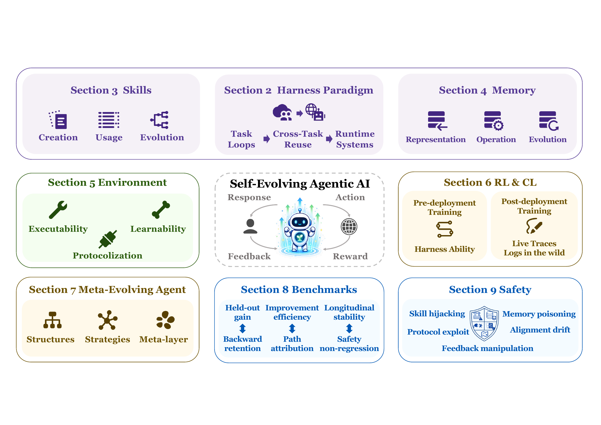
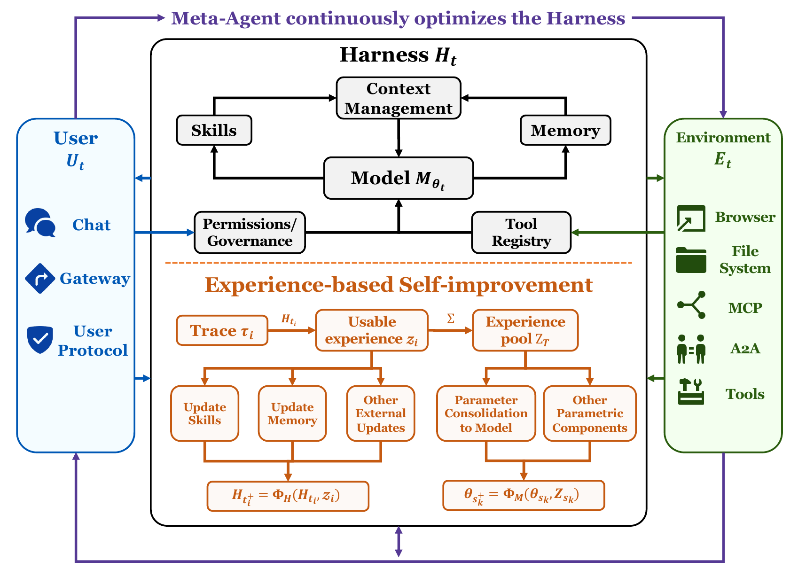

<div align="center">



## Self-Improving Agents in the Era of Experience: A Survey of Self- to Meta-Evolution

[](https://github.com/sindresorhus/awesome)
[](#citation)
[](https://openreview.net/pdf?id=IUltZSgLMm)
[](https://frontis.ai)
[](https://frontisai.github.io/Awesome-Self-Improving-Agents/)

</div>

> We welcome issues and pull requests for missing work on harness agents, agent skills, memory, self-improvement, agent RL, evaluation, and safety.

## News

- **[2026-06-25] 🎉 Release:** Our survey is now available on [OpenReview](https://openreview.net/pdf?id=IUltZSgLMm).

## Citation

If you find this survey or paper list helpful, please cite our work:

```bibtex
@article{jiang2026selfimprovingagents,
  title={Self-Improving Agents in the Era of Experience: A Survey of Self- to Meta-Evolution},
  author={Che Jiang and Jincheng Zhong and Yu Fu and Kai Tian and Junlin Yang and Kaikai Zhao and Yuchong Wang and Tianwei Luo and Weizhi Wang and Yuxin Zuo and Guoli Jia and Xingtai Lv and Dianqiao Lei and Sihang Zeng and Yuru Wang and Zhenzhao Yuan and Xinwei Long and Ermo Hua and Can Ren and Xin Jiang and Shulei Xie and Yuanchun Zheng and Youbang Sun and Biqing Qi and Ning Ding and Kaiyan Zhang and Bowen Zhou},
  journal={OpenReview Archive},
  year={2026},
  url={https://openreview.net/pdf?id=IUltZSgLMm}
}
```

## Contents

- [Overview](#overview)
- [Latest additions](#latest-additions)
- [Browse the collection](#browse-the-collection)
- [Acknowledgment](#acknowledgment)
- [Star History](#star-history)

## Overview

This repository collects papers, systems, benchmarks, and resources for studying how deployed agentic AI systems become more capable after deployment.

We organize the landscape around the **harness agent**: a deployed runtime system whose behavior is jointly shaped by a base model, a mutable harness, a user-facing interface, and an environment-facing interface. Under this view, self-improvement first appears as fast runtime adaptation over external surfaces such as skills, memory, context, tools, and execution environments. Repeated experience may later be consolidated into model parameters through reinforcement learning, fine-tuning, or continual learning.

<p align="center">
   
</p>


We organize the survey into four parts:

1. **Paradigm shift:** from task-bounded tool-use loops to deployed harness-centered runtime systems.
2. **External path:** skills, memory, context, tools, and environments as editable runtime adaptation surfaces.
3. **Parameter path and meta-evolution:** agent RL, continual learning, and meta-agents for durable learning and update orchestration.
4. **Conditions and limits:** evaluation, safety, governance, and open problems for reliable post-deployment improvement.

<!-- catalog:start -->
<!-- Generated by scripts/catalog.py. Edit data/*.json instead of this block. -->
## Latest additions

The catalog snapshot is **2026-09-11**. This section shows up to 20 papers added in the past **7 days**.

| Added | Paper | Survey chapter | Links |
|:-:|:-|:-|:-:|
| 2026-09-11 | Who Maintains Agent Skills? A Longitudinal Study of Human-Governed, AI-Assisted Skill Maintenance | [Measuring Self-Improvement](https://frontisai.github.io/Awesome-Self-Improving-Agents/?chapter=evaluation#papers) | [Paper](https://arxiv.org/abs/2609.05677) |
| 2026-09-11 | TROVE: Adaptive Agent Skill Orchestration via Trace-Grounded Route Validation and Editing | [Skills: Experience Becomes Reusable Procedure](https://frontisai.github.io/Awesome-Self-Improving-Agents/?chapter=skills#papers) | [Paper](https://arxiv.org/abs/2609.05019) |
| 2026-09-11 | The Last AI Built by Humans: Toward Genuine Recursive Self-Improvement | [Introduction](https://frontisai.github.io/Awesome-Self-Improving-Agents/?chapter=foundations#papers) | [Paper](https://arxiv.org/abs/2609.11873) |
| 2026-09-11 | SQL-Zero: Self-Evolving Text-to-SQL | [RL and Continual Learning](https://frontisai.github.io/Awesome-Self-Improving-Agents/?chapter=agent-rl#papers) | [Paper](https://arxiv.org/abs/2609.04697) |
| 2026-09-11 | SkillAdam: Stable and Efficient Skill Evolution for Agents | [Skills: Experience Becomes Reusable Procedure](https://frontisai.github.io/Awesome-Self-Improving-Agents/?chapter=skills#papers) | [Paper](https://arxiv.org/abs/2609.08944) |
| 2026-09-11 | SE-GoS: Self-Evolving Graph-of-Skills for Skill Library at Scale | [Skills: Experience Becomes Reusable Procedure](https://frontisai.github.io/Awesome-Self-Improving-Agents/?chapter=skills#papers) | [Paper](https://arxiv.org/abs/2609.08228) |
| 2026-09-11 | RobustSGPO: Search-Space Control for Agent Harness Evolution | [Harness as Experience Infrastructure](https://frontisai.github.io/Awesome-Self-Improving-Agents/?chapter=harness#papers) | [Paper](https://arxiv.org/abs/2609.09646) |
| 2026-09-11 | Procedural Graphs: Self-Evolving Execution Structures for LLM Agents | [Skills: Experience Becomes Reusable Procedure](https://frontisai.github.io/Awesome-Self-Improving-Agents/?chapter=skills#papers) | [Paper](https://arxiv.org/abs/2609.09153) |
| 2026-09-11 | NeoHorse-1: Towards Recursive Self-Improvement via Agentic Post-Training with Routing Harness | [RL and Continual Learning](https://frontisai.github.io/Awesome-Self-Improving-Agents/?chapter=agent-rl#papers) | [Paper](https://arxiv.org/abs/2609.08183) |
| 2026-09-11 | MetaRSI / RSI2: A Meta-Recursive Self-Improving System for Recursive Self-Improving Systems Themselves | [Meta-Evolving Agents](https://frontisai.github.io/Awesome-Self-Improving-Agents/?chapter=meta-agents#papers) | [Paper](https://arxiv.org/abs/2609.06396) |
| 2026-09-11 | Harness-agnostic detection and immunization of reward hacking in self-evolving language models | [Safety: Self-Improvement as a Moving Attack Surface](https://frontisai.github.io/Awesome-Self-Improving-Agents/?chapter=safety#papers) | [Paper](https://arxiv.org/abs/2609.04665) |
| 2026-09-11 | Graph-Based Personalized Memory for LLM Agents: Representation, Evolution, Retrieval, and Evaluation | [Memory: Experience Becomes Persistent State](https://frontisai.github.io/Awesome-Self-Improving-Agents/?chapter=memory#papers) | [Paper](https://arxiv.org/abs/2609.08599) |
| 2026-09-11 | From Interaction Traces to Persistent Skills: Online Evolution for Computer-Use Agents | [Skills: Experience Becomes Reusable Procedure](https://frontisai.github.io/Awesome-Self-Improving-Agents/?chapter=skills#papers) | [Paper](https://arxiv.org/abs/2609.04869) |
| 2026-09-11 | Experience Funnel: A State-Policy Alternating Loop for Self-Evolving Agents | [RL and Continual Learning](https://frontisai.github.io/Awesome-Self-Improving-Agents/?chapter=agent-rl#papers) | [Paper](https://arxiv.org/abs/2609.08919) |
| 2026-09-11 | Environments as Scaffold: Enriching Feedback to Bootstrap Self-Evolving Agents in Long-Horizon Tasks | [Environment: The Boundary of What Agents Can Experience](https://frontisai.github.io/Awesome-Self-Improving-Agents/?chapter=environment#papers) | [Paper](https://arxiv.org/abs/2609.08404) |
| 2026-09-11 | Ecdysis: Efficient and Effective Training of Runtime Harnesses for LLM Agents | [Harness as Experience Infrastructure](https://frontisai.github.io/Awesome-Self-Improving-Agents/?chapter=harness#papers) | [Paper](https://arxiv.org/abs/2609.11677) |
| 2026-09-11 | CoSkill: Joint Reinforcement Learning of Reasoning and Meta-Skill Agents for Hierarchical Skill Evolution | [RL and Continual Learning](https://frontisai.github.io/Awesome-Self-Improving-Agents/?chapter=agent-rl#papers) | [Paper](https://arxiv.org/abs/2609.04865) |
| 2026-09-11 | COBRA-Skills: Contextual Bandit-Guided Evolution for Agent Skill Optimization | [Skills: Experience Becomes Reusable Procedure](https://frontisai.github.io/Awesome-Self-Improving-Agents/?chapter=skills#papers) | [Paper](https://arxiv.org/abs/2609.11682) |
| 2026-09-11 | Co-Evolving Harnesses and Models: On-Policy Correction Helps Weaker Models Catch Up Where Imitation Fails | [RL and Continual Learning](https://frontisai.github.io/Awesome-Self-Improving-Agents/?chapter=agent-rl#papers) | [Paper](https://arxiv.org/abs/2609.09134) |
| 2026-09-11 | Closing the Consistency Gap: Self-Evolving Agents That Learn to Stay on Course | [Memory: Experience Becomes Persistent State](https://frontisai.github.io/Awesome-Self-Improving-Agents/?chapter=memory#papers) | [Paper](https://arxiv.org/abs/2609.08832) |

## Browse the collection

The complete collection contains **415 papers** organized around the survey's nine chapters.

| Survey chapter | Scope | Papers |
|:-|:-|--:|
| [Introduction](https://frontisai.github.io/Awesome-Self-Improving-Agents/?chapter=foundations#papers) | Foundations, definitions, and surveys that frame self-improving agents. | 22 |
| [Harness as Experience Infrastructure](https://frontisai.github.io/Awesome-Self-Improving-Agents/?chapter=harness#papers) | Runtime architectures that capture experience and expose mutable agent surfaces. | 34 |
| [Skills: Experience Becomes Reusable Procedure](https://frontisai.github.io/Awesome-Self-Improving-Agents/?chapter=skills#papers) | Skill creation, retrieval, composition, execution, and evolution. | 50 |
| [Memory: Experience Becomes Persistent State](https://frontisai.github.io/Awesome-Self-Improving-Agents/?chapter=memory#papers) | Representing, retrieving, consolidating, and evolving agent memory. | 50 |
| [Environment: The Boundary of What Agents Can Experience](https://frontisai.github.io/Awesome-Self-Improving-Agents/?chapter=environment#papers) | Tools, executable environments, protocols, and verifiable runtime feedback. | 48 |
| [RL and Continual Learning](https://frontisai.github.io/Awesome-Self-Improving-Agents/?chapter=agent-rl#papers) | Consolidating stable experience into model parameters and durable behavior. | 35 |
| [Meta-Evolving Agents](https://frontisai.github.io/Awesome-Self-Improving-Agents/?chapter=meta-agents#papers) | Systems that decide what, when, and how an agent should evolve. | 61 |
| [Measuring Self-Improvement](https://frontisai.github.io/Awesome-Self-Improving-Agents/?chapter=evaluation#papers) | Benchmarks and protocols for gain, retention, attribution, and efficiency. | 55 |
| [Safety: Self-Improvement as a Moving Attack Surface](https://frontisai.github.io/Awesome-Self-Improving-Agents/?chapter=safety#papers) | Threats, controls, and governance for agents that change after deployment. | 60 |

**[Search and filter all 415 papers on the project website →](https://frontisai.github.io/Awesome-Self-Improving-Agents/#papers)**

Paper metadata is maintained in [`data/papers.json`](data/papers.json). To suggest a missing work, open a pull request with its public paper link and the most relevant survey chapter.
<!-- catalog:end -->

## Acknowledgment

This repository is maintained by the FrontisAI and Tsinghua University survey team. Its README structure follows the public awesome-list style of [TsinghuaC3I/Awesome-RL-for-LRMs](https://github.com/TsinghuaC3I/Awesome-RL-for-LRMs).

## Star History

<p align="center">
<a href="https://www.star-history.com/?type=date&repos=FrontisAI%2FAwesome-Self-Improving-Agents">
 <picture>
   <source media="(prefers-color-scheme: dark)" srcset="https://api.star-history.com/chart?repos=FrontisAI/Awesome-Self-Improving-Agents&type=date&theme=dark&legend=top-left&sealed_token=vu1SlYbGLJkGVL_9nMHM0hG3O8yzhLz62ujoq9BulHNj7bbNUVfyptQ6_VS-Jb9_1Z_FpmWXTZScvTra2LMxpZYOSrWZwl4LB3BeGD7cMyLFjAg2VIOxY16DHCpFL6O_cYsDzva1SyYWT2MFAIXYP-vItXhDOKiUoW2Rif_eq2sJE425WqUSQZFs6euh" />
   <source media="(prefers-color-scheme: light)" srcset="https://api.star-history.com/chart?repos=FrontisAI/Awesome-Self-Improving-Agents&type=date&legend=top-left&sealed_token=vu1SlYbGLJkGVL_9nMHM0hG3O8yzhLz62ujoq9BulHNj7bbNUVfyptQ6_VS-Jb9_1Z_FpmWXTZScvTra2LMxpZYOSrWZwl4LB3BeGD7cMyLFjAg2VIOxY16DHCpFL6O_cYsDzva1SyYWT2MFAIXYP-vItXhDOKiUoW2Rif_eq2sJE425WqUSQZFs6euh" />
   
 </picture>
</a>
</p>
